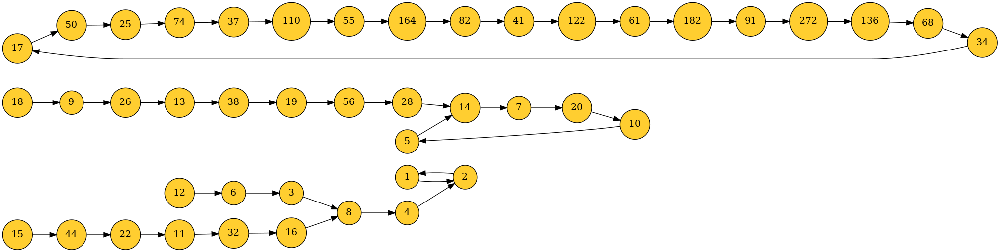

# Collatz

# Installation

In order to create png images of the resulting collatz graphs, install graphviz
(used by dsplot):

```
apt install graphviz libgraphviz-dev
```

Then install the python dependencies:

``` 
pip install -r requirements.txt
```

# Sample

Refer to `main.py` to see how to compute the Collatz graph from 1 to N.

``` 
python main.py 15
```

The path and path length from 1 to N will be printed to screen, with the final 
graph structure saved to *graph.png*.


Note: While the `main.py` reference script (and analogous classes below) can 
quickly compute the entire tree for N up to a few tens of millions, the display 
library seems to have difficulty if the number of nodes is above a few 
thousand.

# Collatz Graph 

You may use the CollatzGraph class to compute Collatz paths in your own code, 
play around interactively, or export an entire Collatz graph to a png file.

```python 
from collatz.collatz import CollatzGraph

graph = CollatzGraph()
path = graph(10)  # [5, 16, 8, 4, 2, 1]
```

To compute the complete graph for all leaf nodes up to N, pass N in as a 
parameter when instantiating the graph. The graph may then be saved to a png 
with the display method.

```python
from collatz.collatz import CollatzGraph

graph = CollatzGraph(N=20)
graph.display(output_path='graph.png')
```

The above code will generate the same image generated by `main.py`. You may 
also generate trees to a given depth using the `levels` parameter when 
instantiating the graph.

```python
from collatz.collatz import CollatzGraph

graph = CollatzGraph(levels=21)
graph.display()
```


# Generalized Collatz Graph

If you wish to define the functions applied to even and odd numbers directly,
you may use the GeneralizedCollatz class and pass in user-defined functions, 
resulting in graphs which may or may not always converge back to 1.

```python
from collatz.generalized_collatz import GeneralizedGraph

graph = GeneralizedGraph(N=20, even_function=lambda n: n // 2, odd_function=lambda n: 3 * n - 1)
graph.display(output_path='3N-1.png')
```



As can be seen, unlike the Collatz Conjecture proper (*3N+1*), the *3N-1* case 
has multiple cycles. In general, it is very difficult to prove that a given 
case will *always* go down to one.

```python 
from collatz.generalized_collatz import GeneralizedGraph

graph = GeneralizedGraph(N=20, even_function=lambda n: n // 2, odd_function=lambda n: 3 * n + 3)
graph.display(output_path='3N+3.png')
```


```python 
from collatz.generalized_collatz import GeneralizedGraph

graph = GeneralizedGraph(N=20, even_function=lambda n: n // 2, odd_function=lambda n: 3 * n - 3)
graph.display(output_path='3N-3.png')
```


# Sequence Length

The length of any given set of sequences can also easily be computed. Refer to
(and/or run) `collatz_len.py` to produce the following plot of the sequence 
length for every value of n up to 100,000.


Feel free to make your own explorations. Utility methods for primality testing 
and prime sieve generation have been given in `utilities.py`, should you want 
to start looking at the intersection of the two. For example, below is a plot 
of the number of primes in each sequence (refer to and/or run `prime_len.py`).


Good luck hunting!